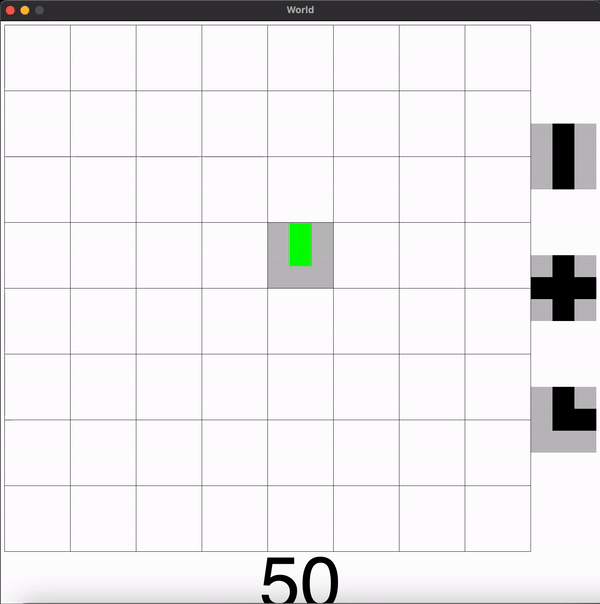

<h1 align="center">Pipe Fantasy</h1>

  

This is Pipe Fantasy! The game is a rendition of the <a href=https://classicreload.com/win3x-pipe-dream-1991.html>Pipe Dream</a> Game! This a simplified version of the game which still allows you to place randomly generated Pipes on the board in order to try to get the "goo", shown through green pipes in gif, to flow! Enjoy the game and the higher the score, the better.

## ‼️Disclaimer‼️

This code is not to be used for college assignments. The code is uploaded to my github as part of my portfolio, but as you all know, this code may not be used as plagiarism and I do not conde any acts made through the **theft** of this code. Other than that though, enjoy!
